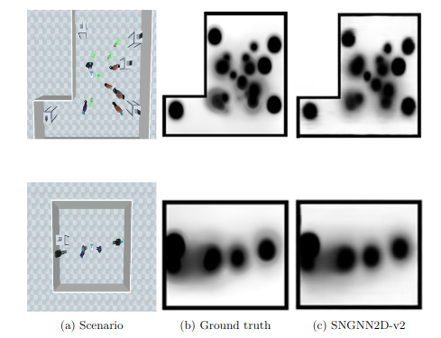
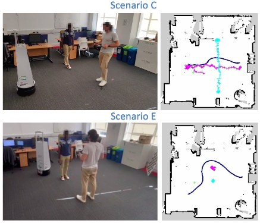

# Social Navigation with Graph Neural Networks 2D (2<sup>nd</sup> version), SNGNN2D-v2

This repository contains the code for the [SNGNN2D-v2: A GNN-Based Model for the Generation of Human-Aware Costs Maps in Dynamic Environments](#) paper.

This work presents a model capable of generating cost maps for Human-Aware Navigation (HAN) with robots that considers the discomfort caused by the robot to pedestrians and the dynamics of the environment.
The model is invariant to changes of appearances in the environment, meaning that it can be trained with the dataset provided or use our trained model, and it can be used in other environments without retraining.
Our model takes the information from a short video (3 seconds) stored in a graph and directly produces the cost map. 

Since the model can generate a map every 11 milliseconds, it can be used in real-time HAN applications.
The following two images represent the output of our model for two different room shapes and a real experiment with a robot using our maps in the ROS navigation stack:

  

## Installation

To install the SNGNN2D-v2 model on your machine, follow these steps:

**1. Clone the repository:**

```bash
git clone https://github.com/gnns4hri/SNGNN2D-v2.git
```

**2. Change directory to the cloned repository:**

```bash
cd SNGNN2D-v2
```

**3a. Install in your local machine:**
You can create a virtual environment with python and run the following command that will install the necessary packages for running and testing the SNGNN2D-v2 model:
```bash
python3 -m pip install -r requirements.txt
```

**3b. Install with docker:**

*NOTE: You need to have docker-compose installed for this option
```bash
docker-compose run --rm sngnn2d-v2
```

You can choose either the installation in your local machine or the docker container. Take into account that the docker container can't display the images when testing the model, they will be saved in the `images_test` directory instead.

## Loading the Dataset

To load the dataset for use with the SNGNN2D-v2 model, follow these steps:

1. **Download the dataset:** Download our dataset from [here](https://www.dropbox.com/scl/fo/k282y10fecljyyl7sjj10/h?rlkey=e1i96zi1nqpfb50k2xh5aq9tx&dl=0). The dataset is available in the file `raw_data.zip`.

2. **Organize the dataset:** Unzip the file `raw_data.zip`in the project root directory. This will create a directory containing the input data (JSON files) and labels (PNG files) for training and testing the model:

```
SNGNN2D-v2
│   ...    
│
└───raw_data
│   │   file0000x.json
│   │   img00000x_Q1.png
│   │   ...
```

3. **Generate train, dev, and test splits:** Navigate to the `dataset/` directory and run the following command to generate the train, dev, and test splits:

```bash
cd dataset
python3 generate_train_dev_test.py ../raw_data
```
Alternatively, you can download the splits used to train the available model from [here](https://www.dropbox.com/scl/fo/k282y10fecljyyl7sjj10/h?rlkey=e1i96zi1nqpfb50k2xh5aq9tx&dl=0) (files `train_set.txt`, `dev_set.txt` and `test_set.txt`.

4. **Adjust split percentages (optional):** If you want to modify the percentages for the train, dev, and test splits, open the `generate_train_dev_test.py` script and locate line 18. The current percentages are 80% for training, 10% for development, and 10% for testing. You can adjust these percentages as needed.

 Once you have generated the splits and confirmed the split percentages, the dataset is ready for training and testing the SNGNN2D-v2 model.

### Data augmentation (Optional)

If you wish to increase the size of the dataset you can create new data samples by mirroring the scenes in the dataset.
You can do so using the scripts in the `dataset/data_augmentation/` directory.

There is a script to mirror the data horizontally (`mirroringH_data.py`) and one to do it vertically (`mirroringV_data.py`).
To run the scripts:

```bash
cd data/data_augmentation
python3 mirroringH_data.py path_to_dataset.txt
python3 mirroringV_data.py path_to_dataset.txt
```
You can run them in any order. It will generate a new TXT file with the new data points.

## Training the model

There are two ways of training our model: training a single model with manually specified hyperparameters or training a batch of models using random search hyperparameter tuning. 
The following sections delve into these two distinct methods.

### Single model training

To train a single model, execute the train_single.py script from the project directory:

```bash
python3 train_single.py
```

To modify the hyperparameters for the specific training, edit the `config/parameters.yml` file before running the training.

Ensure the paths to the dataset's txt files are correct.

The model parameters are saved in the `trained_models/model_params/` directory, with an interval of five epochs.
A `saves/` directory is created after loading the dataset. 
This stores a cached version of the dataset to improve loading speed in subsequent training sessions.
If you want to load a different dataset, delete this directory before loading the new dataset.

### Batched Training for Hyperparameter Tuning

Before starting the batched training for hyperparameter tuning, you'll need to generate a list of tasks with varying hyperparameter combinations.
To do this, execute the following commands from the project's root directory:

```bash
cd utils
python3 generate_training_hyperparameter_samples.py
```

This creates a pickle file in the project root directory named `LIST_OF_TASKS.pckl` that the training script will utilize to train multiple models with distinct hyperparameter configurations. If you wish to alter the range of hyperparameters included in this list, you can modify the `utils/generate_training_hyperparameter_samples.py` script.

Once the list of tasks is generated, you can initiate the batched training process using the following command:

```bash
python3 train_batched.py
```

This command initiates the training of the models specified in the `LIST_OF_TASKS.pckl` file. The training continues until the script is manually terminated. 
The trained models are saved under the directory `trained_models/unique_id/`, where `unique_id` is a unique identifier for each model.

To obtain information about the trained models, models remaining to be trained, failed trainings, the best losses, and more, run the following command:

```bash
cd utils
python3 generate_training_hyperparameter_samples.py
```

For a more concise overview of this information, utilize the `utils/check_list.py` script:

```bash
cd utils
python3 check_list.py
```

Both batched and single training methods create a `saves/` directory.
This directory stores a cached version of the dataset, enabling the script to load the dataset significantly faster after the initial training.

## Testing the Model

To evaluate the performance of either the model you trained or our pre-trained model available [here](https://www.dropbox.com/scl/fo/9ia7vz9sjdlj69sz8yoxi/h?rlkey=ws39q0ylrx3t7soj4cn5k7op1&dl=0), utilize the `test.py` script located in the project's root directory.

To execute the script, provide the path to the JSON file you want to test or a TXT file containing a list of JSON files to evaluate, such as the `test_set.txt` file generated in the preceding steps using the `generate_train_dev_test.py` script.
Additionally, specify the path to the model parameters file.
An example of usage is:

```bash
python3 test.py -f dataset/test_set.txt -m model/ --cuda
```

The `--cuda` parameter enables the script to utilize the GPU and is optional.
Use the option `-v` to indicate the path of the video files containing the scenarios.
A zip file with all the videos can be downloaded from [here](https://www.dropbox.com/scl/fo/k282y10fecljyyl7sjj10/h?rlkey=e1i96zi1nqpfb50k2xh5aq9tx&dl=0).
For detailed instructions on using the script, execute `python3 test.py -h`.


The script will display the image generated by our model alongside the ground truth image and sn image of the scenario if the video is available.
If you provided a TXT file with paths to multiple JSON files, press the Enter key to proceed to the next image. 
To exit the testing process, press the Esc key or close the window.

[https://github.com/gnns4hri/SNGNN2D-v2/blob/main/resources/sngnn2D-v2_demo_video.mp4](https://github.com/user-attachments/assets/a618757d-4479-439c-93f8-e9338f4c993b)

## Citation
