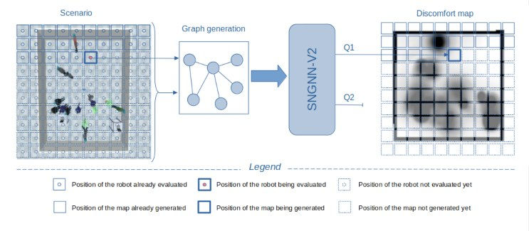

# Social Navigation with Graph Neural Networks 2D (2<sup>nd</sup> version), SNGNN2D-v2

This repository contains the code for the [SNGNN2D-v2: a learning-based scenario-agnostic model for the generation of socially-aware cost maps in dynamic environments](Link to the paper here) paper.

This work presents a model capable of generating cost maps for Human-Aware Navigation (HAN) with robots that considers the discomfort caused by the robot to pedestrians and the dynamics of the environment.
The model is scenario-agnostic, meaning that it can be trained with the dataset provided or use our trained model, and it can be used in any environment without retraining.
Our model takes the information from a short video (3 seconds) stored in a graph and directly produces the cost map. This process is represented in the following figure:



Since the model can generate a map every 11 milliseconds, it can be used in real-time HAN applications.
The following two images represent the output of our model for two different room shapes and a real experiment with a robot using our maps in the ROS navigation stack:

  

## Installation

To install the SNGNN2D-v2 model on your machine, follow these steps:

**1. Clone the repository:**

```bash
git clone https://github.com/gnns4hri/SNGNN2D-v2.git
```

**2. Change directory to the cloned repository:**

```bash
cd SNGNN2D-v2
```

**3. Install the required dependencies:**

```bash
python3 -m pip install -r requirements.txt
```

This will install the necessary packages for running the SNGNN2D-v2 model.

## Loading the Dataset

To load the dataset for use with the SNGNN2D-v2 model, follow these steps:

1. **Download the dataset:** Download our dataset from [here](https://www.dropbox.com/scl/fo/a1inwlhiadogwed2yih2p/h?rlkey=skveqzww03j34zdrqx33xum58&dl=0). The dataset is a collection of folders containing JSON files and PNG images.

2. **Organize the dataset:** Move the contents of each folder into a single directory, such as `raw_data/`, within the project root directory. This will organize the dataset into a consistent structure:

```
SNGNN2D-v2
│   ...    
│
└───raw_data
│   │   file0000x.json
│   │   img00000x_Q1.png
│   │   ...
```

3. **Generate train, dev, and test splits:** Navigate to the `dataset/` directory and run the following command to generate the train, dev, and test splits:

```bash
cd dataset
python3 generate_train_dev_test.py ../raw_data
```

4. **Adjust split percentages (optional):** If you want to modify the percentages for the train, dev, and test splits, open the `generate_train_dev_test.py` script and locate line 18. The current percentages are 80% for training, 10% for development, and 10% for testing. You can adjust these percentages as needed.

 Once you have generated the splits and confirmed the split percentages, the dataset is ready for training and testing the SNGNN2D-v2 model.


## Training the model

There are two ways of training our model: training a single model with manually specified hyperparameters or training a batch of models using random search hyperparameter tuning. 
The following sections delve into these two distinct methods.

### Single model training

To train a single model, execute the train_single.py script from the project directory:

```bash
python3 train_single.py
```

To modify the hyperparameters for the specific training, edit the `train_single.py` file in lines 314-337 before running the training:

```python
best_loss = main('dataset/train_set.txt', 'dataset/dev_set.txt', 'dataset/test_set.txt',
     graph_type='8', # We recommend to always use this graph alternative.
     net='mpnn',  # Options = gat, mpnn, rgcn (mpnn consumes a lot of gpu memory)
     epochs=2300,
     patience=6,  # For early stopping
     batch_size=40,
     num_classes=1,  # This must remain unchanged
     num_channels=35,  # These are the number of channels to the CNN input (GNN output) 
     num_hidden=[95, 71, 62, 57, 45, 35],  # Number of neurons of hidden layers
     heads=[34, 28, 22, 15, 13, 10],  # Only for gat network (same number of heads as num_hidden)
     residual=False,  # Residual connections in the CNN
     lr=0.00005,  # Learning rate
     weight_decay=1.e-11,
     nonlinearity='elu',  # Activation of the hidden layers GNN
     final_activation='relu',  # Activation of the output layer GNN
     nonlinearity_cnn='leaky_relu',  # Activation of the hidden layers CNN
     final_activation_cnn='tanh',  # Activation of the output layer CNN
     gnn_layers=7,  # Must coincide with num_hidden + 1(output layer),
     cnn_layers=3,  # This must remain unchanged
     in_drop=0.,  # This only affect to the GAT network
     alpha=0.2088642717278257,  # This only affect to the GAT network
     attn_drop=0.,  # This only affect to the GAT network
     cuda=True,  # Set it to false if you want to run on CPU
     fw='dgl')  # This must remain unchanged
```

Ensure the paths to the dataset's txt files are correct.

The model parameters are saved in the `trained_models/model_params/` directory, with an interval of five epochs.
A `saves/` directory is created after loading the dataset. 
This stores a cached version of the dataset to improve loading speed in subsequent training sessions.
If you want to load a different dataset, delete this directory before loading the new dataset.

### Batched Training for Hyperparameter Tuning

Before starting the batched training for hyperparameter tuning, you'll need to generate a list of tasks with varying hyperparameter combinations.
To do this, execute the following commands from the project's root directory:

```bash
cd utils
python3 generate_training_hyperparameter_samples.py
```

This creates a pickle file in the project root directory named `LIST_OF_TASKS.pckl` that the training script will utilize to train multiple models with distinct hyperparameter configurations. If you wish to alter the range of hyperparameters included in this list, you can modify the `utils/generate_training_hyperparameter_samples.py` script.

Once the list of tasks is generated, you can initiate the batched training process using the following command:

```bash
python3 train_batched.py
```

This command initiates the training of the models specified in the `LIST_OF_TASKS.pckl` file. The training continues until the script is manually terminated. 
The trained models are saved under the directory `trained_models/unique_id/`, where `unique_id` is a unique identifier for each model.

To obtain information about the trained models, models remaining to be trained, failed trainings, best losses, and more, run the following command:

```bash
cd utils
python3 generate_training_hyperparameter_samples.py
```

For a more concise overview of this information, utilize the `utils/check_list.py` script:

```bash
cd utils
python3 check_list.py
```

Both batched and single training methods create a `saves/` directory.
This directory stores a cached version of the dataset, enabling the script to load the dataset significantly faster after the initial training.

## Testing the model

## Citation